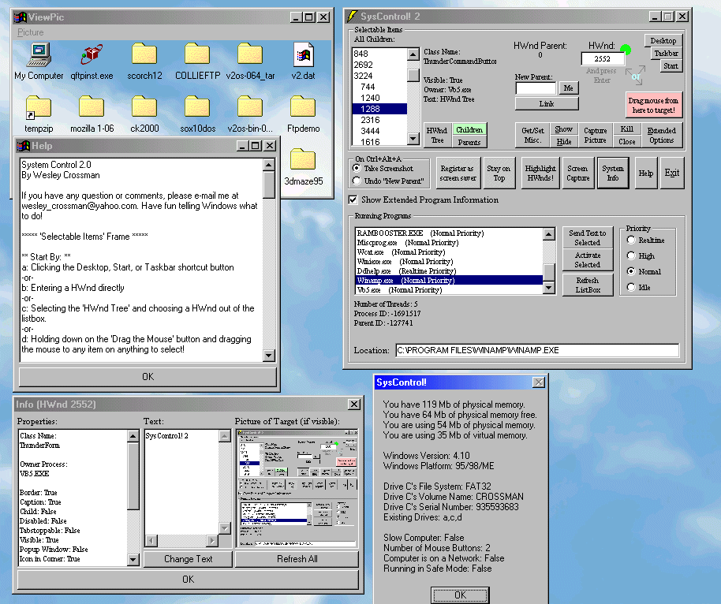



## SysControl \! 2\.0

### Description

This is a program that will let you show, hide, alter text, capture a picture, change the parent, kill, close, enable, disable, get info on, minimize, maximize, restore, capture a picture of, make them stay-on-top, send a message to, edit the window style, and flash the title bar on almost any target! The target can be selected by dragging the mouse from a button to the target or by entering a HWnd! It includes many more features and a complete help system. It also will list all the programs running on your system, will allow you to change their priorities, and will give you info on them too. The program can also perform a screen capture and can even highlight HWnds directly on the screen! It is excellent to learn by, and it's code is thoroughly commented and clean. Also, I would be grateful for any votes you feel fit to give me. I would appreciate them a lot, believe me!
 
### More Info
 

             |
---                |---
**Submitted On**   |2001-01-31 22:39:34
**By**             |[Wesley Crossman](https://github.com/Planet-Source-Code/PSCIndex/blob/master/ByAuthor/wesley-crossman.md)
**Level**          |Intermediate
**User Rating**    |4.8 (48 globes from 10 users)
**Compatibility**  |VB 5\.0, VB 6\.0
**Category**       |[Complete Applications](https://github.com/Planet-Source-Code/PSCIndex/blob/master/ByCategory/complete-applications__1-27.md)
**World**          |[Visual Basic](https://github.com/Planet-Source-Code/PSCIndex/blob/master/ByWorld/visual-basic.md)
**Archive File**   |[CODE\_UPLOAD14392212001\.zip](https://github.com/Planet-Source-Code/wesley-crossman-syscontrol-2-0__1-14897/archive/master.zip)

